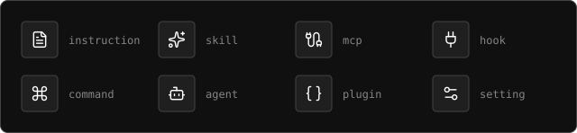
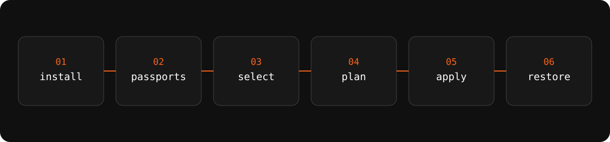

<p align="center">
  <strong>English</strong> · <a href="README.ru.md">Русский</a>
</p>

<p align="center">
  
</p>

<p align="center">
  <a href="https://github.com/ai-engineers-guild/ai-stp/actions/workflows/check.yml"></a>
  <a href="https://pypi.org/project/ai-stp-cli/"></a>
  <a href="LICENSE"></a>
  <a href="https://ai-stp.aiguild.space"></a>
</p>

The command is `ai-stp`. The distribution on PyPI is `ai-stp-cli`. The primary
consumer is the user's agent: every command returns one JSON envelope. `ai-stp`
does not call a model API and does not require a model key.

## One setup, eight kinds, exact versions

<p align="center">
  
</p>

A **setup** belongs to one harness from creation. The eight kinds are
`instruction`, `skill`, `mcp`, `hook`, `command`, `agent`, `plugin`, `setting`.
Memory and rules are content of those kinds, not extra kinds. A published
version pins exact component versions and is immutable.

## CLI assembles, the provider writes

The CLI and the agent select, validate, and bundle. Every command is one JSON
envelope. The CLI does not write the harness's native files. The web owns the
account and the public catalog; it does not assemble or install a setup. Only
the harness provider writes native state.

<p align="center">
  
</p>

Trust is origin, version, and consent. Compatibility — graph, target, and
policy — must decide before apply. A published version is an immutable digest
bound to object version, policy, and device. Sync continues from the last
confirmed cursor. Author verification is origin, not a safety verdict on the
bytes. `author_verified` and `component_verified` are independent.

Local work needs no account. The public catalog is readable anonymously. Google
or GitHub sign-in unlocks private objects, sync, publication, devices, and
grants.

## Install the CLI, then let the agent drive it

```bash
uv tool install ai-stp-cli
ai-stp doctor --json
```

<details>
<summary>Next commands the agent should read from the machine registry</summary>

```bash
ai-stp help --agent --json
ai-stp passport developer init --json
ai-stp device init --json
```

`ai-stp` is the executable. `ai-stp-cli` is the package name. Copying
`uv tool install ai-stp` installs a distribution this project does not publish.

</details>

## Supported harnesses

`full` — native surface and a provider route. `partial` — one of those. `—` — no
native surface. The matrix is `ai-stp toolchain harness-capabilities`.

| Harness | Status | instruction | skill | mcp | hook | command | agent | plugin | setting |
|---|---|---|---|---|---|---|---|---|---|
| Claude Code | Primary | full | full | partial | full | full | full | partial | full |
| Codex | Primary | full | partial | full | partial | full | full | — | full |
| Grok Build | Primary | full | full | full | full | — | partial | full | full |
| Pi | Beta | full | full | partial | — | full | — | full | full |
| OpenCode | Beta | full | full | full | — | full | full | full | full |
| Cursor | Beta | full | full | full | full | full | full | full | full |
| Antigravity | Beta | partial | full | full | full | full | full | full | full |

An unknown harness is `undefined`. Automatic install is refused.

## Current direction: complete the first supported alpha

`0.0.16` is the first supported alpha contract. `0.0.17` continues it as one
public `ai-stp-cli` wheel (`ADR-0146`). The current program finishes verified
provider delivery — GitHub attested releases by default, PyPI provenance as a
second path (`ADR-0141`) — the consumer-owned recoverable multi-root install
over unchanged provider v3 (`ADR-0145`), and one exact estate release record.
`main` is not branch-protected: the gate proves the tree (`ADR-0115`). Rust and
new component kinds are deferred; there is no calendar promise for a language
rewrite.

Phase status belongs to
[`docs/engineering/implementation-roadmap.md`](docs/engineering/implementation-roadmap.md):
read that file when you need the current evidence, not a summary here.

<details>
<summary>Contributing</summary>

- [CONTRIBUTING.md](CONTRIBUTING.md): how changes enter this repository.
- [SECURITY.md](SECURITY.md): how to report a vulnerability.
- [CODE_OF_CONDUCT.md](CODE_OF_CONDUCT.md): expectations for participation.
- [AGENTS.md](AGENTS.md): rules for people and agents. Read before any repository change.

</details>

<details>
<summary>Documentation</summary>

- [docs/index.md](docs/index.md): map of product, architecture, contract, engineering, and operations documentation.
- [docs/product/vision.md](docs/product/vision.md): the problem, users, value, and positioning of ai_stp.
- [docs/product/scope.md](docs/product/scope.md): required MVP capabilities, harness statuses, and explicit exclusions.
- [docs/architecture/overview.md](docs/architecture/overview.md): overall data flow and the boundaries of the local and server environments.
- [specs/index.md](specs/index.md): versioned requirements that the code must satisfy.
- User docs: [English](https://ai-stp.aiguild.space/en/docs) · [Русский](https://ai-stp.aiguild.space/ru/docs)

</details>

<details>
<summary>License</summary>

AGPL-3.0-or-later. Network use of the platform is covered: if `ai-stp` is
offered as a service, the source of the modified version stays available to
those users.

The catalog belongs to the guild. Public harness providers are separate
projects under their own licenses.

Components and setups published by users are independent works licensed by
their authors; the platform license does not apply to them.

</details>
