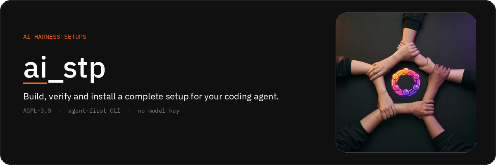
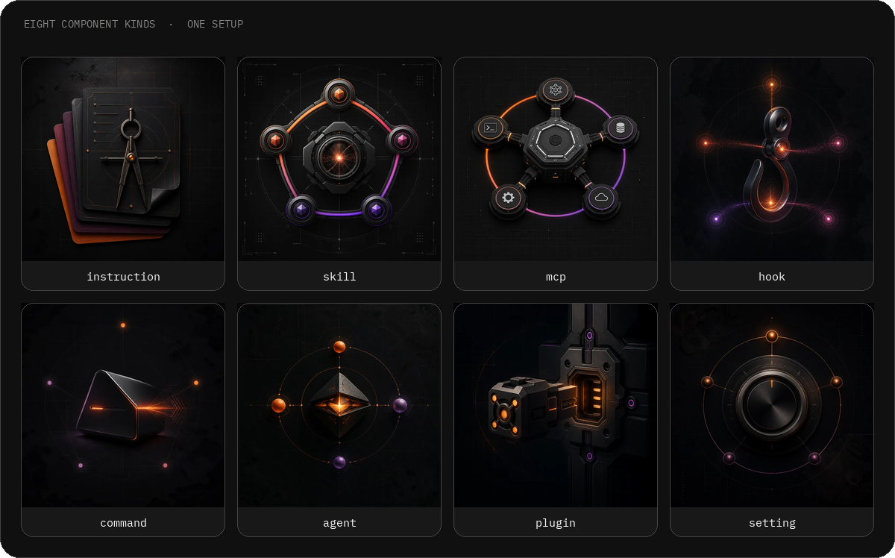
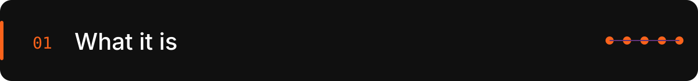
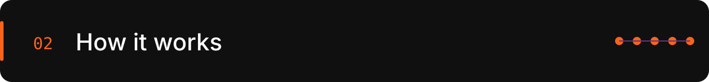
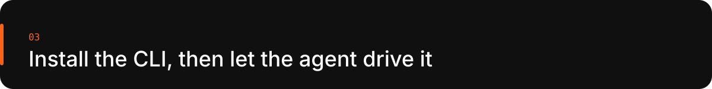

<p align="center">
  <strong>English</strong> · <a href="README.ru.md">Русский</a>
</p>

<p align="center">
  
</p>

<p align="center">
  <a href="https://github.com/ai-engineers-guild/ai-stp/actions/workflows/check.yml"></a>
  <a href="https://pypi.org/project/ai-stp-cli/"></a>
  <a href="LICENSE"></a>
  <a href="https://ai-stp.aiguild.space"></a>
</p>

An [AI Engineers Guild](https://github.com/ai-engineers-guild) project. The
primary consumer is the user's **agent**, through a strict machine CLI. Every
command answers one JSON envelope with typed errors and explicit next actions.
The web application owns the account and the public catalog; it displays
results. Passport creation, indexing, selection, assembly, validation and
installation belong to the CLI and the agent.

<p align="center">
  
</p>

<p align="center">
  
</p>

A **setup** is the complete configuration of one harness: `instruction`,
`skill`, `mcp`, `hook`, `command`, `agent`, `plugin` and `setting`. Memory,
rules and auxiliary tools live inside those kinds. Each installable version is
bound to a harness, a harness version, an operating system, exact component
versions, and validation results.

`ai-stp` does not call a model API and does not require a model key. The final
native state of a harness is written only by that harness's public
**provider** — a released, signed setup-system executable. `ai-stp` validates
the component graph, builds a deterministic bundle, and drives the provider
through a digest-bound plan with backup and rollback. Providers live in
[NDDev-OpenNetwork](https://github.com/NDDev-OpenNetwork) under their own
licenses.

<p align="center">
  
</p>

<p align="center">
  
</p>

```text
install CLI
→ developer and device passports
→ project index
→ find and assemble a setup
→ validation
→ installation plan and backup
→ apply through the harness provider
→ verify state; restore on failure
→ optional cloud synchronization
```

Without an account: local registry, passports, project indexing, read-only
public catalog, selection and installation of public objects.

After sign-in with Google or GitHub: a cloud copy of the personal registry,
private objects, publication, devices and their keys, access grants, and
reports.

<p align="center">
  
</p>

```bash
uv tool install ai-stp-cli
ai-stp doctor --json
```

Then give the agent the machine registry:

```bash
ai-stp help --agent --json
ai-stp passport developer init --json
ai-stp device init --json
```

Every command takes `--json`. The same registry powers human help. The
executable is `ai-stp`; the distribution name is `ai-stp-cli`.

## Supported harnesses

| Status | Harnesses |
|---|---|
| Primary support | Claude Code, Codex, Grok Build |
| Beta support | Pi, OpenCode, Cursor, Antigravity |
| Limited mode | `undefined` for an unknown harness |

## Strategic direction: Rust and a Pi-inspired plugin architecture

**By 31 December 2026, `ai-stp` will be rewritten in Rust and migrated to a
plugin-first architecture inspired by Pi.** The migration will preserve the
public CLI and API contracts while separating a lightweight, deterministic
core from versioned plugins for harnesses, components, projections, and
provider-specific integrations.

## Stage

The sole owner of the current phase status is
[`docs/engineering/implementation-roadmap.md`](docs/engineering/implementation-roadmap.md).
This README does not copy its table: CLI, platform, and release-evidence
progress at different rates, and a single "done" statement would hide
outstanding external evidence.

## Development

Contributors work in personal branches with pull requests into `main`. `main`
is the only line. The process is in
[`docs/engineering/git-workflow.md`](docs/engineering/git-workflow.md).

- [CONTRIBUTING.md](CONTRIBUTING.md): how changes enter this repository.
- [SECURITY.md](SECURITY.md): how to report a vulnerability.
- [CODE_OF_CONDUCT.md](CODE_OF_CONDUCT.md): expectations for participation.

## Documentation

- [AGENTS.md](AGENTS.md): rules for people and agents. Read before any repository change.
- [docs/index.md](docs/index.md): map of product, architecture, contract, engineering, and operations documentation.
- [docs/product/vision.md](docs/product/vision.md): the problem, users, value, and positioning.
- [docs/product/scope.md](docs/product/scope.md): required MVP capabilities, harness statuses, and explicit exclusions.
- [docs/architecture/overview.md](docs/architecture/overview.md): data flow and the local/server boundary.
- [specs/index.md](specs/index.md): versioned requirements the code must satisfy.
- User docs: [English](https://ai-stp.aiguild.space/en/docs) · [Русский](https://ai-stp.aiguild.space/ru/docs)

## License

AGPL-3.0-or-later. The license also covers network use of the platform: if
`ai-stp` is offered to users as a service, the source code of the modified
version remains available to them.

The catalog belongs to the guild. NDDev provides public harness providers;
they remain separate projects under their own licenses and are not relicensed
by this repository.

Components and setups published by users are independent works licensed by
their authors; the platform license does not apply to them.
