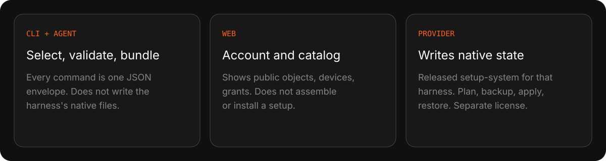
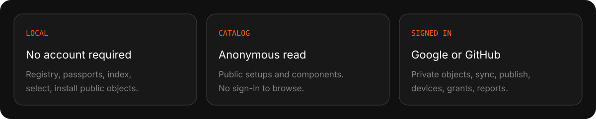

<p align="center">
  <strong>English</strong> · <a href="README.ru.md">Русский</a>
</p>

<p align="center">
  
</p>

<p align="center">
  <a href="https://github.com/ai-engineers-guild/ai-stp/actions/workflows/check.yml"></a>
  <a href="https://pypi.org/project/ai-stp-cli/"></a>
  <a href="LICENSE"></a>
  <a href="https://ai-stp.aiguild.space"></a>
</p>

The command is `ai-stp`. The distribution on PyPI is `ai-stp-cli`. The primary
consumer is the user's agent: every command returns one JSON envelope. `ai-stp`
does not call a model API and does not require a model key.

<p align="center">
  
</p>

<p align="center">
  
</p>

<p align="center">
  
</p>

A **setup** belongs to one harness from creation. The eight kinds are
`instruction`, `skill`, `mcp`, `hook`, `command`, `agent`, `plugin`, `setting`.
Memory and rules are content of those kinds, not extra kinds. A published
version pins exact component versions and is immutable.

<p align="center">
  
</p>

<p align="center">
  
</p>

<p align="center">
  
</p>

<p align="center">
  
</p>

<p align="center">
  
</p>

<p align="center">
  
</p>

<p align="center">
  
</p>

<p align="center">
  
</p>

Author verification is origin, not a safety verdict on the bytes.
`author_verified` and `component_verified` are independent.

<p align="center">
  
</p>

<p align="center">
  
</p>

```bash
uv tool install ai-stp-cli
ai-stp doctor --json
```

<details>
<summary>Next commands the agent should read from the machine registry</summary>

```bash
ai-stp help --agent --json
ai-stp passport developer init --json
ai-stp device init --json
```

`ai-stp` is the executable. `ai-stp-cli` is the package name. Copying
`uv tool install ai-stp` installs a distribution this project does not publish.

</details>

## Supported harnesses

| Status | Harnesses |
|---|---|
| Primary support | Claude Code, Codex, Grok Build |
| Beta support | Pi, OpenCode, Cursor, Antigravity |
| Limited mode | `undefined` for an unknown harness |

Automatic install is refused for an unknown harness.

## Strategic direction: Rust and a Pi-inspired plugin architecture

**By 31 December 2026, `ai-stp` will be rewritten in Rust and migrated to a
plugin-first architecture inspired by Pi.** The migration will preserve the
public CLI and API contracts while separating a lightweight, deterministic
core from versioned plugins for harnesses, components, projections, and
provider-specific integrations.

<details>
<summary>Stage, contributing, documentation</summary>

Phase status belongs to
[`docs/engineering/implementation-roadmap.md`](docs/engineering/implementation-roadmap.md):
read that file when you need the current evidence, not a summary here.

- [CONTRIBUTING.md](CONTRIBUTING.md): how changes enter this repository.
- [SECURITY.md](SECURITY.md): how to report a vulnerability.
- [CODE_OF_CONDUCT.md](CODE_OF_CONDUCT.md): expectations for participation.
- [AGENTS.md](AGENTS.md): rules for people and agents. Read before any repository change.
- [docs/index.md](docs/index.md): map of product, architecture, contract, engineering, and operations documentation.
- [docs/product/vision.md](docs/product/vision.md): the problem, users, value, and positioning of ai_stp.
- [docs/product/scope.md](docs/product/scope.md): required MVP capabilities, harness statuses, and explicit exclusions.
- [docs/architecture/overview.md](docs/architecture/overview.md): overall data flow and the boundaries of the local and server environments.
- [specs/index.md](specs/index.md): versioned requirements that the code must satisfy.
- User docs: [English](https://ai-stp.aiguild.space/en/docs) · [Русский](https://ai-stp.aiguild.space/ru/docs)

</details>

<details>
<summary>License</summary>

AGPL-3.0-or-later. Network use of the platform is covered: if `ai-stp` is
offered as a service, the source of the modified version stays available to
those users.

The catalog belongs to the guild. Public harness providers are separate
projects under their own licenses.

Components and setups published by users are independent works licensed by
their authors; the platform license does not apply to them.

</details>
