<p align="center">
  <a href="README.md">English</a> · <strong>Русский</strong>
</p>

<p align="center">
  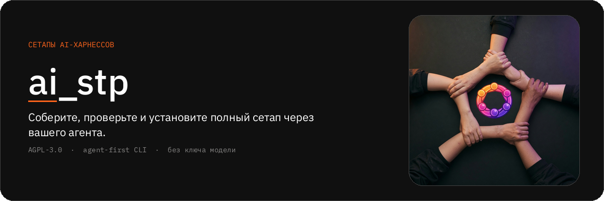
</p>

<p align="center">
  <a href="https://github.com/ai-engineers-guild/ai-stp/actions/workflows/check.yml"></a>
  <a href="https://pypi.org/project/ai-stp-cli/"></a>
  <a href="LICENSE"></a>
  <a href="https://ai-stp.aiguild.space"></a>
</p>

Команда — `ai-stp`. Дистрибутив на PyPI — `ai-stp-cli`. Первичный потребитель —
агент пользователя: каждая команда отвечает одним JSON-конвертом. `ai-stp` не
вызывает API модели и не требует ключа модели.

<p align="center">
  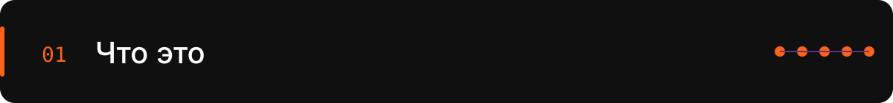
</p>

<p align="center">
  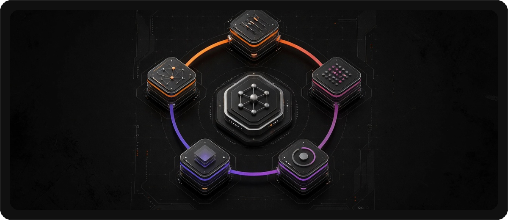
</p>

<p align="center">
  
</p>

**Сетап** с создания принадлежит одному харнессу. Восемь видов:
`instruction`, `skill`, `mcp`, `hook`, `command`, `agent`, `plugin`,
`setting`. Память и правила — содержимое этих видов, не отдельные виды.
Опубликованная версия закрепляет точные версии компонентов и неизменяема.

<p align="center">
  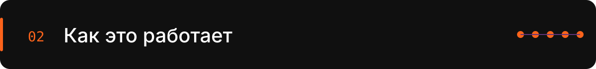
</p>

<p align="center">
  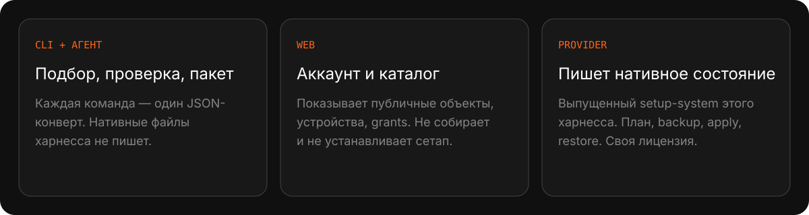
</p>

<p align="center">
  
</p>

<p align="center">
  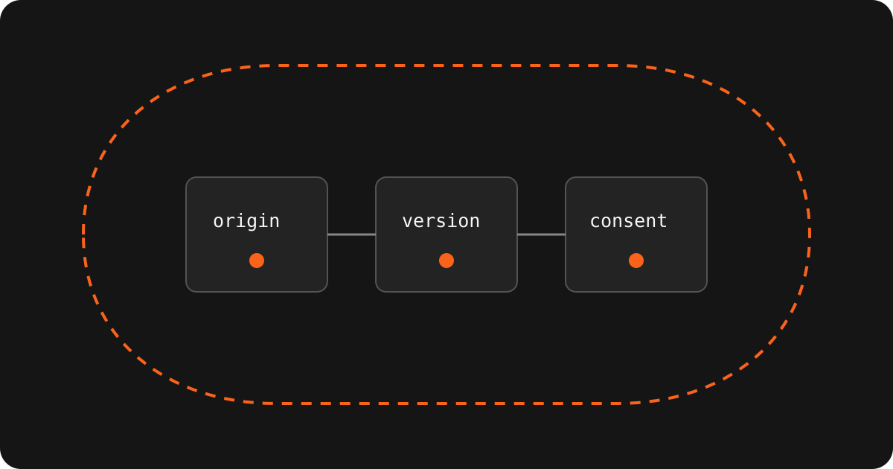
</p>

<p align="center">
  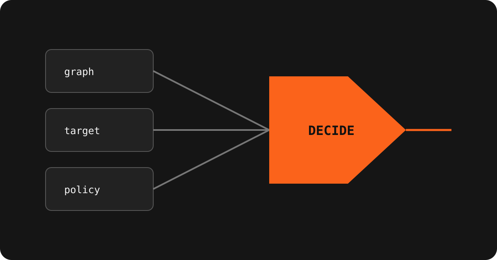
</p>

<p align="center">
  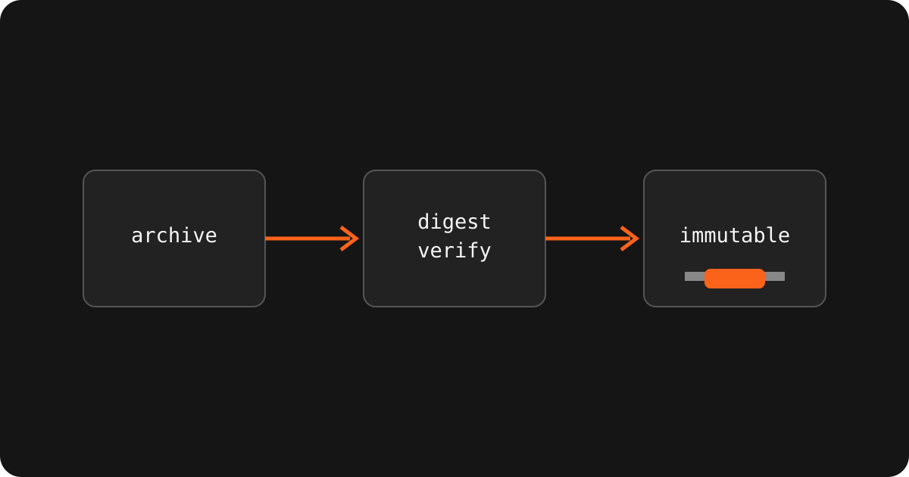
</p>

<p align="center">
  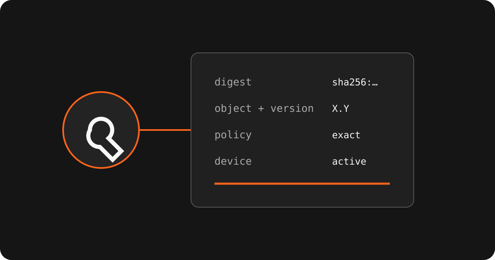
</p>

<p align="center">
  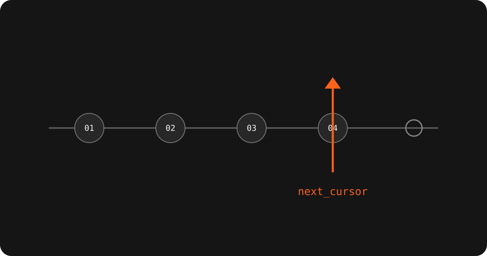
</p>

Подтверждение автора — это происхождение, а не вердикт о безопасности байтов.
`author_verified` и `component_verified` независимы.

<p align="center">
  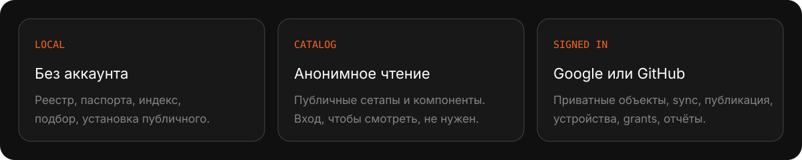
</p>

<p align="center">
  
</p>

```bash
uv tool install ai-stp-cli
ai-stp doctor --json
```

<details>
<summary>Следующие команды агент должен взять из машинного реестра</summary>

```bash
ai-stp help --agent --json
ai-stp passport developer init --json
ai-stp device init --json
```

`ai-stp` — имя исполняемого файла. `ai-stp-cli` — имя пакета. Команда
`uv tool install ai-stp` ставит дистрибутив, который этот проект не публикует.

</details>

## Поддерживаемые харнессы

| Статус | Харнессы |
|---|---|
| Основная поддержка | Claude Code, Codex, Grok Build |
| Бета | Pi, OpenCode, Cursor, Antigravity |
| ограниченный режим | `undefined` для неизвестного харнесса |

Неизвестный харнесс автоматически не устанавливается.

## Текущее направление: завершить первую поддерживаемую alpha-версию

`0.0.16` — первая поддерживаемая alpha-линия. Текущая программа завершает
явные адаптации компонентов для каждого харнесса, принадлежащие provider
многослойные транзакции сетапа, проверенную доставку provider и одну точную
запись релиза всего estate. Rust и новые виды компонентов отложены; календарного
обещания переписать систему на другом языке нет.

<details>
<summary>Стадия, участие, документация</summary>

Статус фазы принадлежит
[`docs/engineering/implementation-roadmap.md`](docs/engineering/implementation-roadmap.md):
это файл, который нужно открыть за текущим evidence, а не краткое изложение здесь.

- [CONTRIBUTING.md](CONTRIBUTING.md): how changes enter this repository.
- [SECURITY.md](SECURITY.md): how to report a vulnerability.
- [CODE_OF_CONDUCT.md](CODE_OF_CONDUCT.md): expectations for participation.
- [AGENTS.md](AGENTS.md): rules for people and agents. Read before any repository change.
- [docs/index.md](docs/index.md): map of product, architecture, contract, engineering, and operations documentation.
- [docs/product/vision.md](docs/product/vision.md): the problem, users, value, and positioning of ai_stp.
- [docs/product/scope.md](docs/product/scope.md): required MVP capabilities, harness statuses, and explicit exclusions.
- [docs/architecture/overview.md](docs/architecture/overview.md): overall data flow and the boundaries of the local and server environments.
- [specs/index.md](specs/index.md): versioned requirements that the code must satisfy.
- User docs: [English](https://ai-stp.aiguild.space/en/docs) · [Русский](https://ai-stp.aiguild.space/ru/docs)

</details>

<details>
<summary>Лицензия</summary>

AGPL-3.0-or-later. Сетевое использование платформы покрыто: если `ai-stp`
предлагается как сервис, исходный код изменённой версии остаётся доступен
этим пользователям.

Каталог принадлежит гильдии. Публичные провайдеры харнессов — отдельные
проекты под своими лицензиями.

Компоненты и сетапы пользователей — самостоятельные произведения под
лицензиями авторов; лицензия платформы на них не распространяется.

</details>
