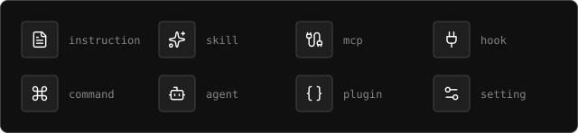
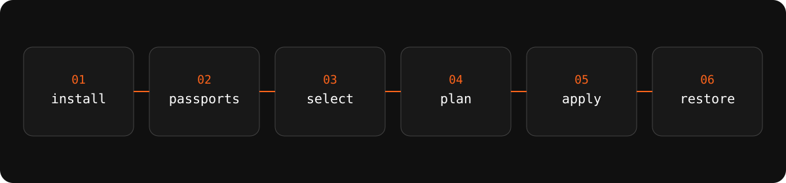

<p align="center">
  <a href="README.md">English</a> · <strong>Русский</strong>
</p>

<p align="center">
  
</p>

<p align="center">
  <a href="https://github.com/ai-engineers-guild/ai-stp/actions/workflows/check.yml"></a>
  <a href="https://pypi.org/project/ai-stp-cli/"></a>
  <a href="LICENSE"></a>
  <a href="https://ai-stp.aiguild.space"></a>
</p>

Команда — `ai-stp`. Дистрибутив на PyPI — `ai-stp-cli`. Первичный потребитель —
агент пользователя: каждая команда отвечает одним JSON-конвертом. `ai-stp` не
вызывает API модели и не требует ключа модели.

## Один сетап, девять видов, точные версии

<p align="center">
  
</p>

**Сетап** с создания принадлежит одному харнессу. Закрытые виды:
`instruction`, `skill`, `mcp`, `hook`, `command`, `agent`, `plugin`,
`setting`, `cli`. `command` — именованный slash-вызов; `cli` — отдельный
исполняемый процесс. Память и правила — содержимое этих видов, не отдельные
виды. Опубликованная версия закрепляет точные версии компонентов и неизменяема.

## CLI собирает, провайдер пишет

CLI и агент подбирают, проверяют и собирают пакет. Каждая команда — один
JSON-конверт. CLI не пишет нативные файлы харнесса. Веб владеет аккаунтом и
публичным каталогом; он не собирает и не устанавливает сетап. Нативное
состояние харнесса пишет только провайдер.

<p align="center">
  
</p>

Доверие — origin, version и consent. Совместимость — graph, target и policy —
решает до apply. Опубликованная версия — неизменяемый digest, связанный с
версией объекта, политикой и устройством. Синхронизация продолжается с
последнего подтверждённого cursor. Подтверждение автора — происхождение, а не
вердикт о безопасности байтов. `author_verified` и `component_verified`
независимы.

Локальная работа не требует аккаунта. Публичный каталог читается анонимно.
Вход через Google или GitHub открывает приватные объекты, синхронизацию,
публикацию, устройства и grants.

## Поставьте CLI, дальше ведёт агент

```bash
uv tool install ai-stp-cli
ai-stp task intents --json
```

<details>
<summary>Следующие команды агент берёт из компактного списка intent</summary>

```bash
ai-stp task intents --json
ai-stp task start --intent initialize --idempotency-key initialize-session-01 --json
```

`help --agent --json` — полный реестр, когда shipped intent недостаточно.
Не дампьте его как прелюдию.

`ai-stp` — имя исполняемого файла. `ai-stp-cli` — имя пакета. Команда
`uv tool install ai-stp` ставит дистрибутив, который этот проект не публикует.

</details>

## Настольное приложение

`apps/desktop` — это `ai-stp-desktop`, оболочка Tauri 2 над тем же
машинным контрактом CLI — каталог, сценарии task-движка, цели и
восстановление в нативном окне для Linux, macOS и Windows. Релизные
пакеты содержат CLI как sidecar, поэтому отдельная установка не нужна.
Свежая сборка — на
[GitHub Releases](https://github.com/ai-engineers-guild/ai-stp/releases?q=desktop)
(пакеты не подписаны; `SHA256SUMS` покрывает каждый артефакт). Детали и
правила границ — в `apps/desktop/README.md` и ADR-0222.

## Поддерживаемые харнессы

`полностью` — нативная поверхность и маршрут провайдера. `частично` — одно из
двух. `—` — нативной поверхности нет. Матрица — `ai-stp toolchain
harness-capabilities`.

| Харнесс | Статус | instruction | skill | mcp | hook | command | agent | plugin | setting | cli |
|---|---|---|---|---|---|---|---|---|---|---|
| Claude Code | Бета | полностью | полностью | частично | полностью | полностью | полностью | частично | полностью | — |
| Codex | Бета | полностью | частично | полностью | частично | полностью | полностью | — | полностью | — |
| Grok Build | Бета | полностью | полностью | полностью | полностью | — | частично | полностью | полностью | — |
| Pi | Бета | полностью | полностью | частично | — | полностью | — | полностью | полностью | — |
| OpenCode | Бета | полностью | полностью | полностью | — | полностью | полностью | полностью | полностью | — |
| Cursor | Бета | полностью | полностью | полностью | полностью | полностью | полностью | полностью | полностью | — |
| Antigravity | Бета | частично | полностью | полностью | полностью | полностью | полностью | полностью | полностью | — |

Неизвестный харнесс — `undefined`. Автоматическая установка для него
отказывается.

## Текущее направление: нативный CLI на Rust

Нативный preview `ai-stp-v2` для Linux x86-64, macOS на Apple Silicon и
Windows x86-64 доступен в
[GitHub Releases](https://github.com/ai-engineers-guild/ai-stp/releases?q=cli-v2-v).
Архивы сопровождаются контрольными суммами и подтверждением происхождения
сборки. Бинарник работает без Python и использует явно выбранное отдельное
состояние. Реализованные возможности, требования к платформам и порядок
проверки описаны в [`apps/cli-v2/README.md`](apps/cli-v2/README.md).

Основным исполняемым файлом `ai-stp` остаётся Python CLI до проверенного
переноса владения состоянием (`ADR-0227`). Нативная установка конфигураций,
подключение аккаунта, синхронизация и публикация, автоматические обновления
и desktop-дистрибуция ещё не завершены. Setup-системы входят в ai-stp как
компоненты установки с отдельными репозиториями релизов (`ADR-0228`).

`main` — защищённая релизная ветка; разработка начинается от `dev`, изменения
входят в неё через PR и затем продвигаются в `main`. Для работы на новом ПК
следуйте [CONTRIBUTING.md](CONTRIBUTING.md#development-on-a-new-workstation).

Статус фазы принадлежит
[`docs/engineering/implementation-roadmap.md`](docs/engineering/implementation-roadmap.md):
это файл, который нужно открыть за текущим evidence, а не краткое изложение здесь.

<details>
<summary>Участие</summary>

- [CONTRIBUTING.md](CONTRIBUTING.md): how changes enter this repository.
- [SECURITY.md](SECURITY.md): how to report a vulnerability.
- [CODE_OF_CONDUCT.md](CODE_OF_CONDUCT.md): expectations for participation.
- [AGENTS.md](AGENTS.md): rules for people and agents. Read before any repository change.

</details>

<details>
<summary>Документация</summary>

- [docs/index.md](docs/index.md): map of product, architecture, contract, engineering, and operations documentation.
- [docs/product/vision.md](docs/product/vision.md): the problem, users, value, and positioning of ai_stp.
- [docs/product/scope.md](docs/product/scope.md): required MVP capabilities, harness statuses, and explicit exclusions.
- [docs/architecture/overview.md](docs/architecture/overview.md): overall data flow and the boundaries of the local and server environments.
- [specs/index.md](specs/index.md): versioned requirements that the code must satisfy.
- User docs: [English](https://ai-stp.aiguild.space/en/docs) · [Русский](https://ai-stp.aiguild.space/ru/docs)

</details>

<details>
<summary>Лицензия</summary>

AGPL-3.0-or-later. Сетевое использование платформы покрыто: если `ai-stp`
предлагается как сервис, исходный код изменённой версии остаётся доступен
этим пользователям.

Каталог принадлежит гильдии. Публичные провайдеры харнессов — компоненты
ai-stp, сохраняющие отдельные репозитории и собственные лицензии.

Компоненты и сетапы пользователей — самостоятельные произведения под
лицензиями авторов; лицензия платформы на них не распространяется.

</details>
