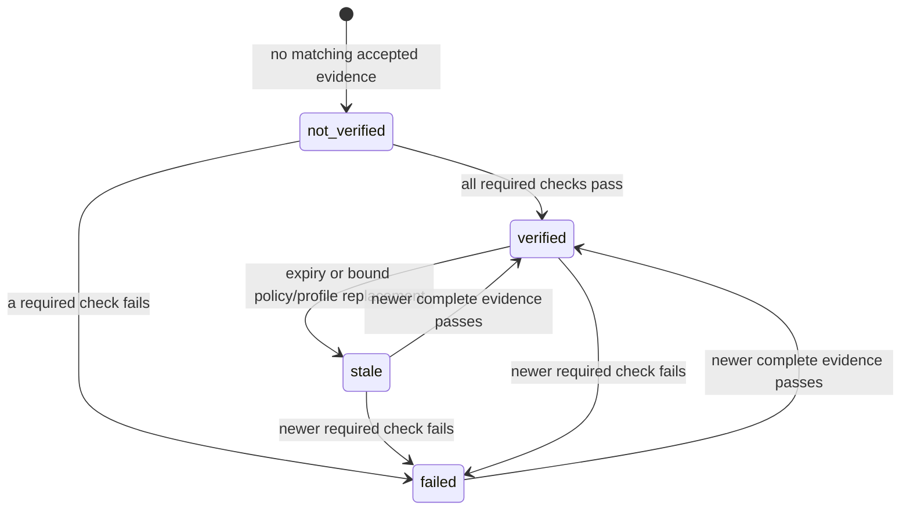

# SPEC-064: Component projections, assurance, and portability

## Purpose

The catalog presents one logical component regardless of how many harness
implementations it contains. Consumers can see and filter exact projections,
understand safety and full-auto eligibility per exact target without treating an
unmaterialized portability assertion as catalog support.

## Scope

Included:

- immutable component-version projection contracts;
- platform persistence and ingestion of target-bound assessments;
- conservative component-level trust projection;
- public and owner API responses;
- exact-only catalog search;
- component cards, detail, exact-version, and owner UI;
- component-level reactions and usage aggregation;
- migration from version-level safety and historical adaptation matrices.

Excluded:

- generating projection bytes in the platform;
- CLI evidence production, materialization, and risk installation, owned by
  issues #148, #149, and #150;
- provider target writes;
- automatic model calls;
- setup-family behavior, owned by `SPEC-065`.

## Terms

- **Projection set** — all exact adaptations contained by one immutable
  component version.
- **Exact availability** — the version has one adaptation whose harness equals
  the requested harness.
- **Artifact observation** — reusable byte-oriented safety evidence for one
  exact artifact digest and scanner policy.
- **Target assessment** — mutable platform evidence for one exact adaptation,
  scope, provider profile, and target platform.
- **Assurance summary** — counts derived from target assessments; it is not a
  replacement for the per-target matrix.

## User-visible flows

### Exact projection

1. A visitor finds one component card.
2. Exact harness badges show which projections exist in the latest public
   version.
3. The detail matrix shows implementation, scope, technical support, safety,
   freshness, and limitations for each target.
4. Opening a setup or install command selects only the row matching that setup's
   harness.

## Data ownership and identity

### Immutable version data

`ComponentVersionPassport` owns:

- one logical component type and logical/source artifact identity;
- one to `len(HARNESS_IDS)` exact adaptations with unique harness IDs;
- the complete version digest over logical content and adaptations.

The public passport contains no portability-claim field. A missing harness is
an unavailable adaptation, never an implied or risk-installable target. The
private CLI portability plan/apply overlay remains local and is rejected by
public publication and setup composition.

### Mutable platform data

Artifact observations and target assessments are append-only evidence records
with a latest-effective projection. Assessment identity contains:

```text
component stable id + version + passport digest
+ adaptation id + harness id + scope adaptation id
+ projection artifact digest
+ provider id + provider version + surface profile id + profile digest
+ target scope + harness version + operating system + architecture
+ policy version
```

The latest-effective pointer may advance; evidence history is retained according
to existing audit retention. Assessment rows cannot modify immutable version
data or author claims.

## Assurance states



Stored evidence is never rewritten to simulate a transition. Effective `stale`
may be calculated at read time from expiry or current policy/profile identity.

## Requirements

- `REQ-6401`: A component stable ID is the single owner of catalog metadata,
  versions, reactions, reports, aggregate views, and aggregate downloads across
  all harness projections.
- `REQ-6402`: A component version MUST contain a non-empty exact projection set
  with at most one adaptation per canonical harness and MUST reject a collection
  larger than `HARNESS_IDS`.
- `REQ-6403`: Adding, removing, or changing an adaptation, projection artifact,
  scope, transform, technical support, permission, limitation, semantic loss, or
  exact adaptation MUST create a new immutable minor version of the same
  component stable ID.
- `REQ-6404`: Component list/search MUST return one row per stable ID. A summary
  MUST expose exact harness IDs and assurance counts and MUST NOT select one
  adaptation's projection kind, OS set, or limitations as the component-wide
  value when adaptations differ.
- `REQ-6405`: Artifact observations MUST bind exact artifact digest, check ID,
  scanner identity/version, policy version, and relevant execution platform.
  Reuse MUST require equality of the complete observation identity.
- `REQ-6406`: Target assessments MUST bind every identity field in the data
  contract. Evidence with a mismatched component, passport, adaptation, scope,
  projection, provider/profile, harness version, OS, architecture, or policy
  MUST be rejected and MUST NOT affect the latest-effective projection.
- `REQ-6407`: Target-assessment stored state MUST be exactly `not_verified`,
  `verified`, `failed`, or `stale`. Missing evidence MUST project
  `not_verified`; expired or replaced evidence MUST project `stale`.
- `REQ-6408`: Byte-oriented artifact observations MAY be shared by equal exact
  projection bytes. Compatibility, scope, provider-surface, target-platform, and
  recommendation results MUST remain independent target assessments.
- `REQ-6409`: Technical support MUST come only from the immutable adaptation.
  Verification MUST come only from accepted platform evidence. Recommendation
  MUST be derived from current policy and MUST be ineffective unless technical
  support is `supported` and assessment is `verified`.
- `REQ-6410`: `component_verified` MUST be true only when common mandatory checks
  and every policy-required advertised adaptation/scope target are current and
  verified. Mixed, missing, failed, and stale required targets MUST produce
  false without mutating the component version.
- `REQ-6411`: Assessment refresh MUST append evidence and atomically advance the
  latest-effective projection. Concurrent retries with the same idempotency key
  and complete identity MUST produce one effective result.
- `REQ-6412`: Public component passports, catalog rows, facets, cursors,
  search predicates, and UI MUST contain no portability-claim model. The CLI
  portability plan/apply commands MAY write only a private local overlay.
- `REQ-6413`: Public multi-harness support MUST be materialized as an exact
  adaptation, published in a new component version, and assessed for its exact
  target. A private overlay MUST NOT change public passport, catalog, search,
  facets, setup compatibility, or installation eligibility.
- `REQ-6414`: `harness_id`/`harness_ids` catalog filters MUST match only exact
  published adaptations. A component with several matching adaptations remains
  one stable-ID result and one card.
- `REQ-6415`: Cursor signatures and bounded summaries MUST contain only exact
  filter inputs, exact target counts, and stable-ID ordering. No claim mode or
  claim facet may be serialized or accepted by the API.
- `REQ-6416`: Component cards MUST show one object, exact harness badges, and a
  compact `verified targets / assessed targets` summary. Counts MUST be
  computed across the complete exact target set, never from a first or default
  adaptation.
- `REQ-6417`: Public component detail and exact-version responses MUST expose a
  row for every exact adaptation/scope. Each row contains harness, target scope,
  implementation mode, projection kind, technical support, OS, architecture,
  permissions, semantic losses, assessment state, freshness/currentness,
  full-auto recommendation, and safe evidence references.
- `REQ-6418`: Public component UI MUST render the exact matrix as keyboard and
  screen-reader accessible stacked cards at all widths. Verified, stale, failed,
  not verified, supported, experimental, unsupported, and full-auto states MUST
  have distinct localized text independent of color.
- `REQ-6419`: Owner API/UI MUST expose missing, stale, and failed target coverage,
  rejected evidence reason codes, and the next valid action.
  Raw scanner output, internal object keys, local paths, and other owners'
  private evidence MUST remain unavailable.
- `REQ-6420`: Public setup validation MUST require an exact published adaptation
  whose harness equals the setup harness. A private overlay or missing target
  MUST fail with `adaptation_unavailable` and MUST not close a public setup graph.
- `REQ-6421`: Public Web MUST expose no risk-install action and MUST never turn
  an author assertion or private overlay into a catalog recommendation.
- `REQ-6422`: Likes and reports MUST remain keyed by component stable ID.
  Aggregate component views/downloads MUST count once per existing event
  contract; optional harness breakdown MUST sum to, and never duplicate, the
  aggregate under the same deduplication policy.
- `REQ-6423`: Public evidence projection MUST contain only public identifiers,
  digests, timestamps, approved reason codes, policy/profile identities, and
  allowlisted evidence references. Credentials, secret values, raw reports,
  storage keys, and personal data MUST not enter responses, logs, or fixtures.
- `REQ-6424`: Search/list performance MUST preserve the existing page and cursor
  bounds. The matrix MUST remain a detail/version projection; summaries carry
  only bounded exact harness IDs and counts.
- `REQ-6425`: Every public and owner response MUST use generated shared contracts;
  API, seed fixtures, web mocks, and TypeScript client MUST be regenerated from
  source and cover every harness in canonical `HARNESS_IDS`.
- `REQ-6426`: Publication validation MUST scan each unique exact projection
  artifact digest in the component version, persist artifact observations, and
  write one target assessment per exact adaptation/scope. Identical bytes MUST
  reuse the observation identity. Missing projection bytes MUST project
  `not_verified`. A failed projection MUST NOT change another projection's
  stored state. The version-level publish gate remains the common-source scan.

## API contract

| Surface | Additive behavior |
|---|---|
| `GET /v1/catalog/components` | Exact harness IDs, bounded assurance summary, and optional match reason; no full matrix. |
| `GET /v1/catalog/components/{stable_id}` | Latest-version exact target summary; the detail response contains the exact target matrix. |
| `GET /v1/catalog/components/{stable_id}/versions/{version}` | Exact target matrix and immutable adaptation data for the requested version. |
| `GET .../versions/{version}/checks` | Common checks plus target-bound assessment summaries with safe evidence references. |
| Existing owner exact-version read | Full owner-safe coverage diagnostics and exact adaptation data. |
| Publication `VALIDATE` | Platform safety suite over the common-source artifact and every unique exact projection digest; one target assessment per adaptation/scope. |

Requests remain strict. New response fields are additive. Unknown harness, state,
transform family, or evidence reason is a validation error. The removed
`compatibility=claimed_portable` request is rejected as an unknown parameter.

## Web presentation

| Surface | Required presentation |
|---|---|
| Catalog card/list row | One component; exact harness badges; bounded verified/assessed target counts. |
| Component detail | Current-version exact target overview, accessible matrix/card layout, and version history. |
| Exact version | Immutable adaptation facts and effective assessment context for that version. |
| Owner version | Coverage gaps, stale/failed reasons, evidence refresh, or publish-new-version guidance. |
| Filters | Exact published harness adaptations, URL-preserved and keyboard accessible. |

## States and errors

- `AI_STP_VALIDATION_ERROR`: unknown target, unsupported identity, or malformed
  evidence binding.
- `AI_STP_CONFLICT`: duplicate adaptation harness, duplicate active assessment
  identity with conflicting result, or stale idempotency payload.
- `AI_STP_CATALOG_INTEGRITY`: passport, projection, or evidence digest mismatch
  in a reachable public record.
- `AI_STP_NOT_FOUND`: absent or inaccessible component/version/evidence.
- `adaptation_unavailable`: setup/install asks for a harness with no exact
  published adaptation; a private overlay does not change this code.

## Security and privacy

Assessment ingestion is authenticated as a platform evidence writer and checks
object ownership only for publication association, never as authority to issue
verification. Public reads enforce catalog visibility before joining evidence.
Evidence URLs use the existing allowlist and redirect policy. All joins and
search predicates are parameterized and tenant/private rows cannot affect public
counts. Artifact bytes are verified before observation reuse.

## Observability

Structured events record accepted/rejected assessment ingestion, full-key
mismatch reason, effective-state transition, and aggregate-verification change.
Metrics count states and rejections by safe harness/check/reason dimensions
without stable IDs or user data. Alerts cover failed migration/backfill and
impossible verified-without-key invariants.

## Compatibility and migration

1. Add nullable/additive contract fields and new evidence indexes.
2. Restore historical adaptation-matrix rows only when every new key field is
   proven from immutable data; all others become `not_verified` and remain in
   audit history.
3. Recompute conservative component verification and search summaries.
4. Deploy readers before enabling the stricter assessment writer.
5. Rebuild exact-only search projections and cursors before removing legacy
   public claim fields from the wire surface.

Historical component passports, stable IDs, versions, reactions, and aggregate
counters are not rewritten. Rollback disables new writers/readers and leaves
new rows inert; it never restores unverifiable aggregate verification.

## Acceptance criteria

| Requirement | Executable oracle |
|---|---|
| `REQ-6401` | Publishing a version with another harness projection preserves one stable-ID card, reaction target, report target, and aggregate-counter subject. |
| `REQ-6402` | Passport/schema property tests accept one unique adaptation per canonical harness and reject empty, duplicate, unknown, and over-limit sets. |
| `REQ-6403` | Digest/version tests change each projection field independently and require the next minor while preserving unchanged referenced artifacts. |
| `REQ-6404` | Search projection tests keep one row and omit misleading singular projection/OS/limitation values for heterogeneous adaptations. |
| `REQ-6405` | Observation tests reject reuse after changing artifact, check, scanner, policy, or relevant execution-platform identity. |
| `REQ-6406` | Table-driven ingestion tests change every target-assessment key field and prove rejection with no effective-state update. |
| `REQ-6407` | Clock-controlled tests cover missing, all stored states, expiry, and policy/profile replacement. |
| `REQ-6408` | Two targets with equal bytes share the byte result but retain independent assessment rows. |
| `REQ-6409` | Contract/domain tests vary author support, evidence, and recommendation independently and reject author-issued recommendation. |
| `REQ-6410` | Mixed three-harness fixtures prove aggregate true only when every required target and common check is current and verified. |
| `REQ-6411` | PostgreSQL concurrency tests prove idempotent retry, append-only history, and one atomic latest-effective row. |
| `REQ-6412` | Contract, API, and fixture tests contain no public portability-claim field, facet, predicate, cursor mode, badge, or row; private CLI overlay remains local. |
| `REQ-6413` | Publication and setup tests prove a new public harness requires a materialized adaptation, a new version, and exact assessment. |
| `REQ-6414` | API tests prove harness filters return only exact published adaptations and one result per stable ID. |
| `REQ-6415` | Facet/cursor tests prove exact-only bounded counts and reject the removed compatibility/claim mode. |
| `REQ-6416` | Component tests render one card, exact badges, correct counts, and no target inflation. |
| `REQ-6417` | Contract/API fixtures cover heterogeneous exact rows with every required field and safe omission. |
| `REQ-6418` | RU/EN component and browser tests cover desktop/mobile, keyboard/table semantics, and text labels independent of color. |
| `REQ-6419` | Owner API/web tests show actionable target gaps while public snapshots contain none of the owner-only fields. |
| `REQ-6420` | Public setup publication rejects a missing exact adaptation and accepts the component only after the exact target is published. |
| `REQ-6421` | Web tests show no claim badge, compatibility control, or risk-install action. |
| `REQ-6422` | Reaction and counter regression tests preserve stable-ID uniqueness and prove harness breakdown does not exceed or duplicate aggregate events. |
| `REQ-6423` | Redaction, non-enumeration, URL-policy, logging, and fixture scans reject every prohibited data class. |
| `REQ-6424` | Search benchmark and contract tests preserve page/cursor bounds and prove summaries never embed the full matrix. |
| `REQ-6425` | Generated-schema drift, OpenAPI reachability, fixture conformance, web typecheck, and canonical-harness inventory checks pass. |
| `REQ-6426` | Validate writes one assessment per exact adaptation/scope; equal projection bytes share the scan; a failed projection leaves the other rows unchanged; missing bytes stay `not_verified`. |
