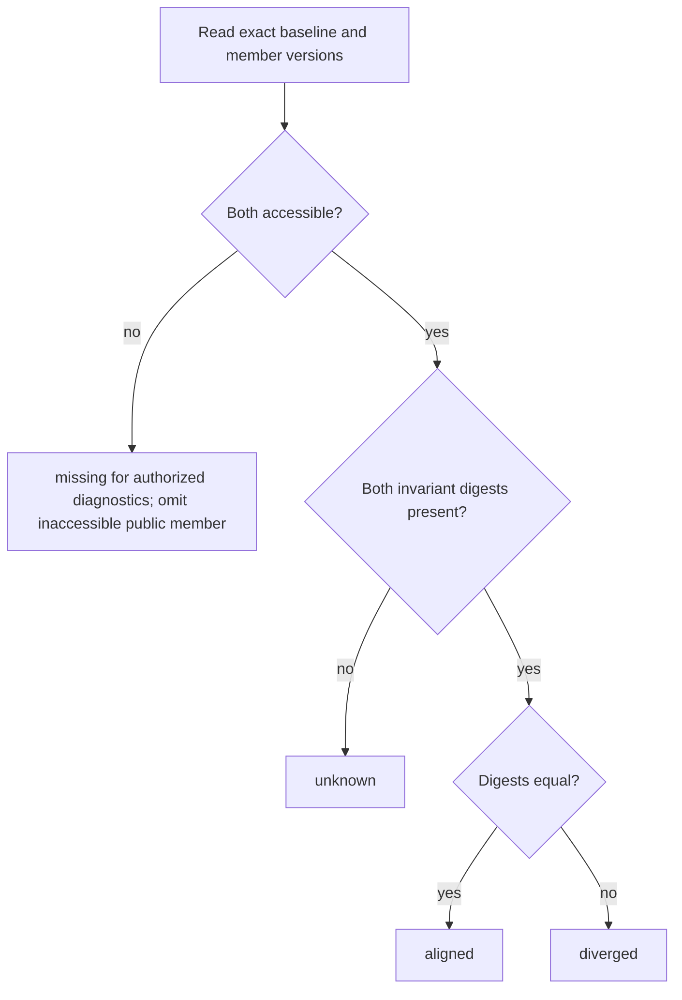

# SPEC-065: Setup families and harness-invariant alignment

## Purpose

Users can navigate between harness-specific forms of the same logical setup and
see whether exact versions are aligned or have drifted. Each setup remains an
independent installable object for one harness, and its composition identifies
only the exact component projections selected for that harness.

## Scope

Included:

- preservation of immutable recast provenance;
- mutable setup-family identity, membership, baseline, and audit revisions;
- canonical setup and component logical invariant digests;
- version-to-baseline alignment projection;
- public and owner API contracts;
- setup search, card, detail, version, and composition presentation;
- migration from unambiguous provenance graphs;
- canonical open-beta harness support projection retained from archived
  `SPEC-063`.

Excluded:

- changing the rule that a setup belongs to one harness;
- a shared family version, family install bundle, reaction, verification, or
  trust line;
- automatic merge, synchronization, or propagation between setup members;
- CLI recast changes beyond the shared invariant/family contract;
- inference of semantic equivalence from names, tags, descriptions, or component
  count.

## Terms

- **Setup family** — platform-owned navigational grouping of setup stable IDs.
- **Family member** — one setup stable ID tied to one canonical harness.
- **Baseline** — exact accessible setup version against which family alignment
  is calculated.
- **Component logical digest** — canonical digest of the harness-independent
  source/meaning of one exact component version.
- **Setup invariant digest** — canonical digest of harness-independent setup
  meaning and ordered exact logical members.
- **Alignment** — `aligned`, `diverged`, `unknown`, or `missing` relative to the
  baseline.
- **Provenance edge** — immutable `ported_from` and `related_setup_ids` facts in
  a setup version passport; it is not family membership.

## User-visible flows

### Open a family member

1. A visitor opens one setup page.
2. The page identifies its harness, exact latest version, and current support
   tier.
3. A family section shows other accessible harness members and their alignment
   against the explicit baseline.
4. The setup composition shows each exact component version and only the
   adaptation selected for the viewed setup harness, including target assurance.
5. Install continues to address this setup only.

### Publish a recast member

1. CLI submits an exact setup version with `ported_from`, related IDs, and an
   invariant digest.
2. Platform validates publication and immutable provenance.
3. If source and target meet owner/visibility rules, platform idempotently adds
   the new setup to the source family or creates a family for the pair.
4. Platform compares the exact published version to the family baseline and
   exposes the resulting alignment.
5. Failure to update mutable family metadata does not partially publish an
   unauthorized relationship; the operation is retried through its durable job.

## Immutable setup contract

Every new setup version carries `harness_invariant_digest` in a dedicated
canonical digest domain. Its input is:

```text
setup purpose
+ posture and execution profile
+ ordered required capabilities
+ ordered setup members:
   component stable id
   + exact component version and passport digest
   + component logical digest
   + member role/requiredness owned by the setup contract
```

The input excludes:

- setup harness and origin harness;
- adaptation IDs and implementation modes;
- projection artifacts, members, native paths, and native IDs;
- provider/profile/package identities;
- mutable assessment, support tier, recommendation, lifecycle, reactions, and
  usage counters;
- descriptions, media, and presentation metadata.

Changing excluded native details alone preserves the invariant. Changing setup
purpose/posture/execution profile, required capabilities, ordered membership,
exact logical component version, or component logical digest changes it.

Historical versions without both required logical digests remain valid and
project `unknown`; the platform does not synthesize a digest from incomplete
data.

## Mutable family contract

`SetupFamily` contains:

| Field | Contract |
|---|---|
| `family_id` | Stable opaque public identifier in a dedicated namespace. |
| `owner_account_id` | Authorization owner; private internal field in public projection. |
| `name` | Mutable bounded family display name; defaults through an explicit create policy, not member-name inference on read. |
| `baseline` | Exact `(setup stable ID, version, passport digest)` member reference. |
| `members` | Unique setup stable IDs; at most one active member per canonical harness. |
| `created_from` | `recast`, `owner`, `staff_migration`, or `migration` provenance. |
| `revision` | Monotonic mutable revision used for optimistic concurrency. |
| `created_at` / `updated_at` | Audit timestamps. |

Membership revisions are append-only audit facts containing actor, reason,
previous/new baseline, added/removed members, idempotency key, and timestamp.
Removing a member does not delete or mutate that setup. A setup belongs to at
most one active family.

## Alignment projection



Alignment is calculated for exact versions carried by the response. Latest
member alignment may change only because a new setup version, a baseline change,
or visibility/lifecycle projection changes; the historical alignment of an
exact pair is deterministic.

## Requirements

- `REQ-6501`: A setup MUST retain one stable ID, one immutable harness, separate
  versions, lifecycle, trust, assessments, access, reactions, reports, counters,
  and install route regardless of family membership.
- `REQ-6502`: A family MUST NOT have a setup passport, `X.Y` version, component
  list, bundle, trust line, verification flag, reaction endpoint, download
  artifact, or install command and MUST be rejected wherever an exact setup
  reference is required.
- `REQ-6503`: Seed and publication paths MUST preserve validated `ported_from`
  and `related_setup_ids` exactly. Public and owner exact-version reads MUST
  expose the same immutable values subject to visibility filtering of linked
  navigation.
- `REQ-6504`: Every newly written setup version MUST carry a valid
  `harness_invariant_digest` calculated from the declared canonical inputs.
  Platform and CLI fixture vectors MUST produce identical bytes and digest.
- `REQ-6505`: The invariant MUST change for every included semantic input and
  MUST remain unchanged when only any excluded harness-native, provider,
  assessment, lifecycle, social, or presentation field changes.
- `REQ-6506`: Historical setup versions lacking required logical/invariant data
  MUST remain readable and MUST project `unknown`; readers MUST NOT infer or
  backfill equality from names, tags, descriptions, provenance, or member count.
- `REQ-6507`: A family MUST have one owner, one exact accessible baseline,
  unique member setup IDs, at most one active member per harness, and at least
  two members. A setup MUST belong to at most one active family.
- `REQ-6508`: Family create/update/remove-member/change-baseline operations MUST
  require owner or existing staff authority, expected revision, idempotency key,
  complete precondition revalidation, and one append-only audit revision.
- `REQ-6509`: A family mutation MUST be atomic. Ownership conflict, duplicate
  harness, inaccessible baseline/member, stale revision, or changed precondition
  MUST leave family and setup records unchanged.
- `REQ-6510`: Recast publication MAY join the source family only when source and
  target satisfy family ownership and visibility policy. It MUST retain exact
  `ported_from`; family membership MUST be a separate audited effect and MUST
  not derive authority from the provenance edge.
- `REQ-6511`: If neither recast setup belongs to a family, authorized publication
  MUST create one family for the pair with the source exact version as baseline.
  Idempotent redelivery MUST not create a second family or revision.
- `REQ-6512`: Alignment MUST be `aligned` only for equal present invariant
  digests, `diverged` for unequal present digests, `unknown` for absent digest,
  and `missing` only in authorized diagnostics for unavailable member/baseline.
- `REQ-6513`: Public family projections MUST include only publicly visible
  members and safe setup/version/harness/provenance/alignment fields. An
  inaccessible member MUST not be disclosed by ID, count, ordering gap, error,
  or timing-dependent response.
- `REQ-6514`: `GET /v1/catalog/setups/{stable_id}` and the exact-version route
  MUST add optional family context containing family ID/name, exact baseline,
  current member, accessible members, per-member latest/exact version, harness,
  provenance, and alignment.
- `REQ-6515`: Owner setup reads MUST additionally expose family revision,
  diagnostics for inaccessible/missing references without foreign identity, and
  allowed next actions. Family writes MUST use dedicated authenticated owner
  routes and MUST not overload setup passport publication.
- `REQ-6516`: Setup list/search MUST remain one row per setup stable ID. It MAY
  expose family ID and accessible member count and MUST NOT collapse members into
  one result or return a family as installable content.
- `REQ-6517`: Setup search filters for family ID, member harness, and alignment
  MUST be explicit, parameterized, visibility-safe, and included in cursor
  signatures. A match MUST identify the matching setup row and reason.
- `REQ-6518`: Setup detail UI MUST show the current setup before a family section.
  Family members MUST be grouped/labeled by harness and show exact version,
  provenance, and alignment with distinct localized text for every state.
- `REQ-6519`: Exact setup-version UI MUST calculate alignment for that exact
  version, not silently substitute the member's latest version. Navigation to
  another member MUST preserve locale and address that setup's public route.
- `REQ-6520`: Setup composition MUST show, for every component member, the exact
  component stable ID/version/passport digest and the one adaptation selected
  for the setup harness, including implementation mode, scopes, projection kind,
  target assessment, and limitations from `SPEC-064`.
- `REQ-6521`: Other adaptations present in a component version MAY be reachable
  through the component link but MUST NOT be rendered as installed members of
  the viewed setup. A missing exact adaptation MUST be a composition integrity
  failure, not a claimed-portable fallback.
- `REQ-6522`: Public Web MUST NOT expose install-family, like-family,
  verify-family, merge, synchronize, propagate, replace, or shared-version
  controls. Installation and likes continue to address the current setup.
- `REQ-6523`: Setup likes, reports, views, and downloads MUST remain keyed to the
  setup stable ID. A family total MAY be calculated only as a labeled derived sum
  of accessible members and MUST not be persisted or ranked as a family event.
- `REQ-6524`: During migration, the platform MAY create a family only for one
  unambiguous connected provenance graph whose public members have compatible
  ownership, no duplicate harness, no conflicting active membership, and an
  exact accessible source baseline. Every skipped graph MUST receive a safe
  machine-readable reason and MUST remain ungrouped.
- `REQ-6525`: Migration MUST NOT rewrite historical setup passports or invent
  historical invariant digests. Rollback MUST disable family projections and
  leave setup identity, versions, provenance, reactions, counters, and install
  behavior intact.
- `REQ-6526`: Catalog support tier MUST continue to derive from canonical
  `SUPPORT_TIERS`, independently of family, provenance, alignment, assessment,
  and trust. During current OBT every harness in canonical `HARNESS_IDS` MUST
  project as `beta`; no migration or web fixture may contain a second tier map.
- `REQ-6527`: Web harness facets, setup cards, family members, filters, mocks,
  and generated contracts MUST cover every canonical harness and MUST not assume
  a fixed smaller primary subset.
- `REQ-6528`: Family and provenance projections MUST contain no credentials,
  secrets, private source coordinates, local paths, personal data, raw assessment
  reports, or fabricated ownership/authorization.
- `REQ-6529`: Family reads MUST avoid per-member database queries and remain
  within existing catalog page/detail response bounds. Public member count MUST
  count accessible members only.
- `REQ-6530`: Structured events and metrics MUST cover family creation/mutation,
  rejected membership reason, migration outcome, alignment counts, and missing
  baseline conditions using safe dimensions without leaking private IDs.

## API contract

| Surface | Contract |
|---|---|
| `GET /v1/catalog/setups` | Additive family ID/member count/alignment match summary; still one setup row. |
| `GET /v1/catalog/setups/{stable_id}` | Latest accessible family context and current setup composition projection. |
| `GET /v1/catalog/setups/{stable_id}/versions/{version}` | Family context aligned to the requested exact version and immutable provenance. |
| `GET /v1/catalog/setup-families/{family_id}` | Public accessible family navigation projection; never installable content. |
| `GET /v1/owner/setup-families/{family_id}` | Owner projection with revision and safe diagnostics. |
| `POST /v1/owner/setup-families` | Idempotent authorized family creation with exact baseline and members. |
| `PATCH /v1/owner/setup-families/{family_id}` | Expected-revision mutation of name, baseline, or membership. |

The exact owner route prefix must reuse the repository's established owner
router when implementation begins; generated OpenAPI is the final wire owner.
No family mutation is added to anonymous catalog routes.

## Web presentation

| Surface | Required presentation |
|---|---|
| Setup card/list row | Setup harness remains primary; optional family member count is secondary and never replaces install CTA. |
| Setup detail | Current setup header and composition, then family members by harness with alignment and provenance. |
| Exact setup version | Exact-version provenance, exact baseline comparison, exact selected component adaptations. |
| Owner workspace | Family membership, baseline, revision, alignment gaps, and bounded create/edit controls. |
| Search filters | Family and alignment filters preserve URL, locale, keyboard operation, reset, and cursor semantics. |

Alignment text must explain: `aligned` means equal declared invariant, not proof
of behavioral equivalence; `diverged` means logical inputs differ; `unknown`
means historical evidence is absent; `missing` is not shown with foreign ID on
public surfaces.

## States and errors

- `AI_STP_VALIDATION_ERROR`: invalid family shape, unsupported harness, malformed
  exact baseline, or invalid filter.
- `AI_STP_CONFLICT`: stale expected revision, duplicate active membership,
  duplicate harness, conflicting baseline, or idempotency-key payload mismatch.
- `AI_STP_NOT_FOUND`: absent or inaccessible public/owner family or member,
  preserving non-enumeration.
- `AI_STP_CATALOG_INTEGRITY`: reachable family references a conflicting exact
  setup passport/digest or composition lacks the exact selected adaptation.
- Family-audit delivery failure is retried durably; no unaudited mutation is
  considered committed.

## Security and privacy

Family writes use existing account/staff authorization, CSRF/session boundaries,
idempotency, and audit requirements. Public joins apply setup visibility before
membership aggregation. Error bodies and metrics do not reveal hidden member
IDs or owner IDs. Canonicalization accepts only validated passport fields and
does not read artifacts, paths, or secret-bearing configuration. Family data is
not authority for component or setup access.

## Observability

Events carry operation type, family revision, actor class, safe reason code,
member count, and alignment transition; stable object IDs remain in restricted
audit logs only. Metrics expose operation/result, harness, alignment, migration
reason, and latency. Alerts cover impossible duplicate active membership,
baseline not in family, unaudited committed mutation, and repeated migration
failure.

## Compatibility and migration

1. Release shared logical/invariant digest contracts and fixture vectors; new
   setup writers begin emitting the optional digest.
2. Add family, membership, and revision tables plus nullable search/detail
   projection fields.
3. Deploy readers; historical versions project `unknown` and ungrouped setups
   retain the existing provenance block.
4. Run a dry migration report, then create only unambiguous families under
   `REQ-6524` and rebuild search projections from canonical support data.
5. Enable owner writes and recast-family ingestion after idempotency and audit
   tests pass.
6. Replace the flat related-setup UI with family presentation while retaining
   exact `ported_from` on version pages.

Old clients ignore additive response fields. Historical setup passports and
versions remain immutable. Database rollback disables family reads/writes; it
does not delete or rewrite setups. If family tables are retained after rollback,
they are inert and cannot affect search, install, trust, or counters.

## Acceptance criteria

| Requirement | Executable oracle |
|---|---|
| `REQ-6501` | Regression tests prove family add/remove changes none of the member setup identity, version, harness, lifecycle, access, trust, reaction, counter, or install records. |
| `REQ-6502` | Contract/API tests reject family IDs in setup/version/bundle/reaction/download/install parameters and expose none of the prohibited family fields. |
| `REQ-6503` | Seed/publication/public/owner round-trip tests preserve exact provenance; absent provenance remains null/empty without fabricated links. |
| `REQ-6504` | Shared golden vectors produce identical canonical bytes/digests in CLI-compatible and platform implementations. |
| `REQ-6505` | Property tests mutate each included and excluded input and prove the required digest change/invariance. |
| `REQ-6506` | Historical fixtures without logical/invariant data remain readable and project `unknown` without a synthesized digest. |
| `REQ-6507` | Schema/database tests enforce owner, exact member baseline, unique membership, unique active harness, minimum membership, and one active family per setup. |
| `REQ-6508` | API/domain tests require authority, expected revision, idempotency, revalidation, and exactly one audit revision. |
| `REQ-6509` | PostgreSQL transaction tests inject every listed conflict/failure and observe no partial family or audit state. |
| `REQ-6510` | Recast integration tests cover authorized join and cross-owner/private refusal while preserving exact provenance. |
| `REQ-6511` | Recast redelivery creates one two-member family, one baseline, and one membership revision. |
| `REQ-6512` | Clock/fixture tests cover aligned, diverged, unknown, and authorized missing states for exact version pairs. |
| `REQ-6513` | Non-enumeration tests compare absent/private-member responses, counts, ordering, errors, and bounded timing behavior. |
| `REQ-6514` | Public detail/version contract tests return complete accessible family context and exact-version alignment. |
| `REQ-6515` | Owner contract/API tests expose revision/diagnostics/actions and prove setup publication cannot mutate family metadata. |
| `REQ-6516` | Search tests keep separate setup rows and never return a family as an object or install result. |
| `REQ-6517` | SQL/cursor tests cover each family filter, visibility, match reason, parameterization, and cross-signature rejection. |
| `REQ-6518` | RU/EN desktop/mobile web tests render current setup first and every accessible member with distinct alignment text. |
| `REQ-6519` | Exact-version navigation tests prove historical alignment is not replaced by latest member state and locale is preserved. |
| `REQ-6520` | Composition contract/web tests render exact component refs and only the setup-harness adaptation with complete assessment summary. |
| `REQ-6521` | Multi-adaptation fixture tests hide unrelated adaptations from composition and reject missing exact target despite a current claim. |
| `REQ-6522` | Accessibility/component tests prove only current-setup install/like actions exist and every prohibited family control is absent. |
| `REQ-6523` | Reaction/counter tests preserve per-setup keys and prove any displayed family sum is derived from accessible members without writes. |
| `REQ-6524` | Migration dry-run fixtures cover valid graph and every skip condition with stable safe reason codes. |
| `REQ-6525` | Migration/rollback tests compare historical passport bytes, provenance, identities, reactions, counters, and install behavior before/after. |
| `REQ-6526` | Projection/migration tests derive `beta` for every canonical OBT harness from `SUPPORT_TIERS` independently of family/alignment/evidence. |
| `REQ-6527` | Inventory and locale tests cover every `HARNESS_IDS` value in facets, cards, families, filters, mocks, and generated schemas. |
| `REQ-6528` | Contract snapshots, log tests, and secret scanning prove every prohibited data class is absent. |
| `REQ-6529` | Query-count and response-bound tests prove bounded family reads without per-member query growth and accessible-only counts. |
| `REQ-6530` | Event/metric tests cover success/failure/migration/alignment while public telemetry snapshots contain no private identifiers. |
