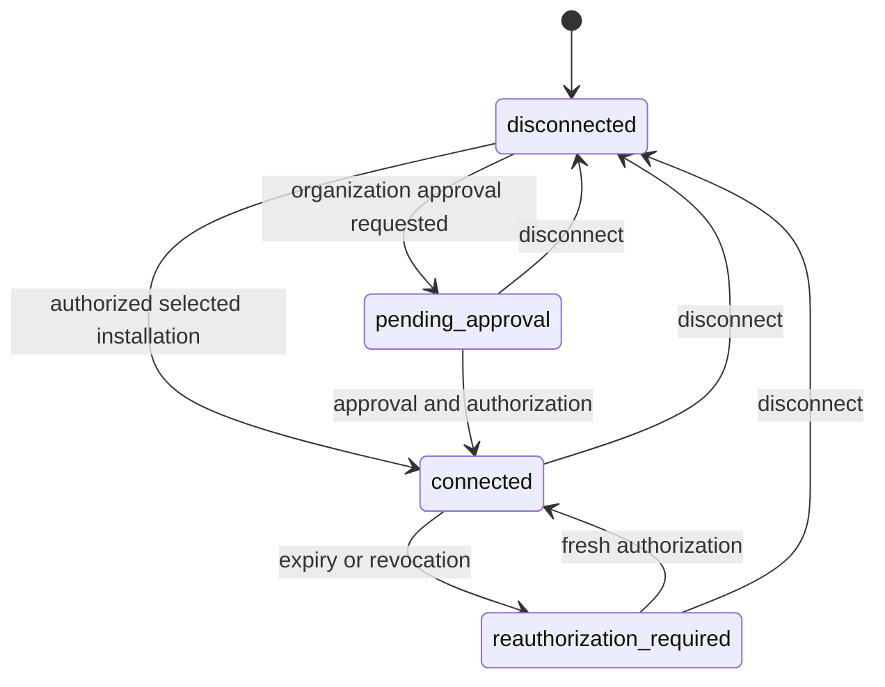

# SPEC-073: GitHub Connector and source publication

## Purpose

An authenticated owner connects authorized GitHub repositories, publishes a component
from an exact snapshot and separately decides whether to invite a collaborator or
expose a repository. GitHub sign-in continues to establish identity only.

## Scope

Issues [181](https://github.com/ai-engineers-guild/ai-stp/issues/181),
[182](https://github.com/ai-engineers-guild/ai-stp/issues/182),
[183](https://github.com/ai-engineers-guild/ai-stp/issues/183),
[184](https://github.com/ai-engineers-guild/ai-stp/issues/184),
[185](https://github.com/ai-engineers-guild/ai-stp/issues/185) and
[186](https://github.com/ai-engineers-guild/ai-stp/issues/186).
Artifact authorization remains with SPEC-026 and SPEC-071. Client-side artifact
encryption and general RBAC are separate work.

## Terms

A connector is one account's explicit GitHub App user authorization. An installation
scope is the live intersection of that user's access and the App's repositories. The
scope may contain multiple personal and organization installations, each retaining its
GitHub account identity and repository-selection mode. A source binding is a
server-only immutable association of repository identity, exact commit, subpath and
canonical artifact with a publication. Installation scopes are displayed separately and
are never collapsed into one account or silently discarded when another installation
grants all repositories.
An administrative connector is separately consented authority for repository
administration; a component grant never confers that authority.

## Requirements

- `REQ-7301`: Normal GitHub sign-in never authorizes private source access. A
  separate authenticated, CSRF-protected connect action starts an account/session-
  bound, expiring, one-use OAuth flow. Installation links carry the same one-use
  state before the external page opens, so an installation callback can continue
  the flow without accepting an unbound GitHub redirect. Callback replay, another
  account, a missing session and a mismatched GitHub identity refuse.
- `REQ-7302`: Ordinary connection uses a public GitHub App with metadata and
  contents read and repository administration write. It includes every active personal
  or organization installation returned for the connected GitHub identity, whether the
  installation grants all repositories or only selected repositories. The API and UI
  preserve installation account identity and show each installation separately. The
  same App is used for source and administration, but administration is a separate
  explicit consent and every mutation has its own plan and confirmation. Ordinary
  source operations never mutate GitHub.
- `REQ-7303`: Expiring user tokens are stored encrypted on the server with a
  dedicated deployment key and account/purpose binding. Tokens, refresh material
  and App credentials never enter browser storage, passports, audit payloads,
  public responses or logs. Expired authorization requires reconnection.
- `REQ-7304`: Repository reads recheck live user installation membership, authorized
  repository identity and effective contents permission. Missing, expired, revoked,
  suspended, unselected or insufficient access fails closed; cached
  metadata is not authority. Organization approval remains an explicit pending
  result, not a successful connection.
- `REQ-7305`: Disconnect removes usable local token material and makes subsequent
  source access fail closed. The user can separately revoke the App on GitHub.
  Disconnecting source access does not revoke existing ai-stp artifact grants.
- `REQ-7306`: Source preparation accepts only a selected repository ID, full commit
  SHA and bounded component subpath. It verifies the returned repository and exact
  commit and downloads through official GitHub API/archive hosts, stripping
  authorization on cross-host redirects. Ref substitution, unsafe redirects,
  ambiguous archive members and traversal refuse.
- `REQ-7307`: Preparation reuses the canonical component-tree packer and bounded
  source extractor. GitHub archives contain tracked snapshot files, including
  tracked files matched by ignore patterns; ignored untracked working-tree files
  cannot enter that snapshot. Links, special files, secret-like paths, invalid
  text, excessive size and empty/missing roots refuse. Inventory is sorted and
  binds the exact packed bytes and digest.
- `REQ-7308`: Private repository coordinates remain only in the server-only source
  binding. A privately sourced passport has no GitHub source coordinates. The
  binding records observed source visibility, publisher, installation, immutable
  repository identity, commit, subpath, artifact digest/size and passport digest.
  The server accepts a missing component source only with that verified binding.
- `REQ-7309`: Connector publication retains ordinary plan, artifact, safety and
  owner checks. Preparation grants no public exposure. Plan confirmation rechecks
  the connector and selected repository; identical retries retain the binding and
  bytes. Public publication from a currently private source refuses.
- `REQ-7310`: Owner component visibility changes use the SPEC-071 visibility plan
  and an explicit confirmation. Private-to-public and public-to-private changes,
  including harmless repeated requests, preserve version, passport, provenance,
  artifact identity, digest, bytes and bucket location. Withdrawal stops future
  anonymous service access but cannot revoke acquired copies.
- `REQ-7311`: Promotion rechecks current owner/device, digest, lifecycle, public
  publisher profile, license, tags, artifact integrity, mandatory validation and
  public source eligibility before updating any public projection. Bound GitHub
  sources are re-resolved anonymously at their exact commit/subpath and compared
  with stored canonical bytes. Private or unavailable sources refuse. A bound
  source may satisfy provenance without rewriting the historical passport.
- `REQ-7312`: A public version is served with explicit
  `distribution_visibility=public`. Catalog search, detail, exact version and
  artifact reads observe the same distribution policy; withdrawal removes every
  anonymous projection and read. Existing owner/grantee access remains valid. No
  object-store copy is performed.
- `REQ-7313`: Invitation plans require a separately connected administration consent,
  selected repository, current owner/admin authority and exact recipient/role. The
  consent uses the same GitHub App as source access; it does not create a second App.
  Personal private repositories warn that collaborator access includes write;
  read-only is available only where the organization supports it. Confirmation
  is explicit and server-enforced. Component grant creation sends no invitation.
  An authenticated action-status read refreshes pending/accepted invitation state
  without sending an invitation; revoked or missing invitations are not reported
  as pending. The read rechecks selected repository and owner/admin authority.
- `REQ-7314`: Repository-visibility plans bind immutable repository ID, owner ID,
  full name, prior visibility, actor, device, expiry and digest. Confirmation
  requires the exact full repository name and a separate affirmative confirmation
  after warning about public history exposure or the limits of making a repository
  private again. The server
  rechecks scope, current admin authority, identity and visibility immediately
  before mutation. GitHub organization policy refusals produce no local success.
- `REQ-7315`: Repository actions are durable and idempotent. Concurrent confirmation
  is serialized. A lost response leaves a reconcilable result; retry reads current
  GitHub invitation/visibility before another mutation. An already-public target
  is harmless. Expired unknown plans may reconcile an observed effect but cannot
  issue a new mutation. Stale names, ownership, scope and request hashes refuse.
- `REQ-7316`: Connector lifecycle, repository actions and failures produce audit
  records with actor, opaque target identity, outcome and timestamp, without
  private source coordinates or credentials. GitHub 401/403/404/422/429 and
  transport failures map to stable, safe, actionable platform errors.
- `REQ-7317`: Account and owner interfaces expose one connector status, selected
  repositories and disconnect. Component visibility belongs to the owned-object
  action menu; repository visibility belongs to the connector repository list.
  Installation and user authorization are separate steps. The connector links the
  GitHub identity first, installs/selects repositories second, and starts the OAuth
  web flow with an explicit environment callback last. OAuth during installation is
  disabled because GitHub otherwise always selects the App's first callback URL.
  Both use separately confirmed plans in English and Russian. Keyboard,
  narrow-screen, busy, failure and retry states remain usable and failed status
  or connect requests are visible to the user. The CLI uses the same
  source/publication authority and never accepts a GitHub token as a grant.
- `REQ-7318`: Readiness distinguishes local tests from live personal/organization
  installation evidence. Deployment config, callbacks, permissions, credential
  rotation, rollback and the acceptance matrix are documented. Unconfigured Apps
  are unavailable, never replaced with a global token or ordinary OAuth login.

## States and errors

Connector states are `disconnected`, `pending_approval`, `connected` and
`reauthorization_required`. Pending requests can be completed after organization
approval; disconnect clears authority from every state. Expiration or live denial
requires reauthorization. Repository plans are `planned`, `applied`, `failed` or
`unknown`; unknown effects require reconciliation before retry.

Existing platform validation, permission, precondition, dependency and rate-limit
errors carry safe reason identifiers. No raw upstream response enters an error.
Visibility-plan states remain owned by SPEC-071.

## Security and privacy

Authorization checks precede source or object-store reads. The server chooses
GitHub hosts and token audience. No arbitrary URL or pasted token is a connector.
An App authorization is bound to the same linked GitHub subject as the signed-in
account. Repository management never follows implicitly from source publication,
component promotion or an ai-stp grant. Actual repository exposure and invitation
each require the user's specific final confirmation.

## Compatibility and migration

Add connector, source-binding and operation-plan tables without rewriting existing
passports or object locations. Existing public source resolution remains anonymous
by default and refuses private sources without a scoped connector. Existing
visibility wire models are reused. Missing-source private components are accepted
only through the source-bound path. Deploy additive migrations before enabling
the App settings; disabling those settings blocks new connector operations without
removing published artifacts. Rollback retains the new tables and immutable bytes.

## Acceptance criteria

| Requirement | Executable verification |
|---|---|
| `REQ-7301` | Login does not connect; account/session/state mismatch and callback replay refuse. |
| `REQ-7302` | One selected-repository App installation exposes metadata/contents read and administration write; source access and each management action still require separate consent and server-side checks. |
| `REQ-7303` | Stored token ciphertext is account/purpose-bound; expiry refuses; response/log scans contain no token. |
| `REQ-7304` | Personal/organization selected access passes; unselected, suspended, revoked and insufficient access refuse. |
| `REQ-7305` | Disconnect prevents source reads while an existing private artifact grant still works. |
| `REQ-7306` | Exact missing/mismatched commit, unsafe subpath/redirect and ambiguous members refuse. |
| `REQ-7307` | Snapshot fixtures verify ignore semantics, sorted inventory, canonical digest, links, secrets and bounds. |
| `REQ-7308` | Private source binding survives publication; passport/public responses expose no private coordinates. |
| `REQ-7309` | Public with/without connector and private with connector pass; revoked confirmation and private public-source requests refuse. |
| `REQ-7310` | Owner opening, withdrawal and replay preserve exact version/passport/artifact/location; non-owner refuses. |
| `REQ-7311` | Each failed public precondition leaves visibility and projections unchanged. |
| `REQ-7312` | Anonymous catalog/detail/version/download and owner/grantee reads agree after opening and withdrawal. |
| `REQ-7313` | Owner invitation, pending/accepted replay, non-admin refusal and personal write warning are tested; administration uses the same App registration. |
| `REQ-7314` | Typed-name, affirmative confirmation, stale target and organization-policy refusal are enforced server-side. |
| `REQ-7315` | Concurrent and lost-response retries reconcile without duplicate invitations or unintended exposure. |
| `REQ-7316` | Upstream error matrix and audit assertions contain safe identifiers only. |
| `REQ-7317` | RU/EN component/browser tests and CLI contract tests exercise the same plans and refusal states. |
| `REQ-7318` | Repository gates pass; live installation/mutation evidence is recorded separately on exact deployed identity. |
