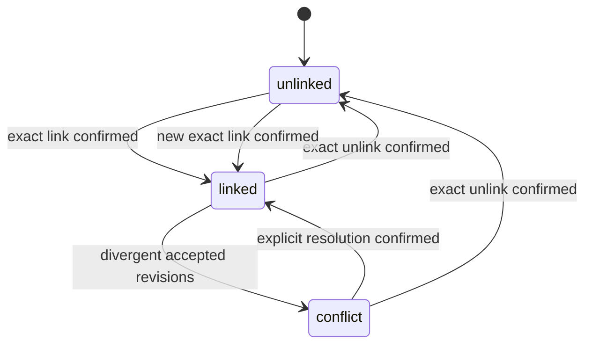

# SPEC-078: Project identity, linking, and synchronization

## Purpose

Let a local project participate in personal or corporate cloud workflows without
silently matching, merging, duplicating, or overwriting unrelated projects.

## Scope

This specification owns issue #229. It defines local, remote, and provider
project identities; link plans and states; uniqueness; link/unlink behavior;
revision synchronization; conflict handling; provider rename/move behavior; and
the contract consumed by technology detection, landscape, and forge discovery.

It does not define project technology detection, GitLab discovery, corporate
project administration, or landscape presentation. Those later issues consume
the identities and links defined here. It does not synchronize installed harness
targets or make source-provider access equivalent to organization authority.

## Terms

- **Local project** — a project adopted on one device with a stable local
  `project_…` identity and local passport/index.
- **Remote project** — a server `project_…` identity owned by one personal or
  corporate organization.
- **Provider binding** — optional evidence connecting a remote project to an
  immutable repository identifier from GitHub, GitLab, or another supported
  forge.
- `ProjectLink` — the revisioned owner decision binding one local project to one
  remote project.
- **Link proposal** — a non-authoritative candidate produced from bounded
  evidence; it cannot synchronize or merge data.

## Requirements

- `REQ-7801`: Adopting a project creates a random typed local `project_…`
  identifier stored with the local project record and passport. Reopening the
  same adopted record preserves the identifier without deriving it from path,
  name, Git URL, or file contents.
- `REQ-7802`: Local path, display name, Git remotes, checkout state, and observed
  repository metadata are mutable evidence. A move, rename, remote change, or
  clone does not replace the local identifier or create a cloud link.
- `REQ-7803`: A remote project has a separate stable `project_…` identifier and
  exactly one `organization_id`. Its display name, aliases, lifecycle, and
  provider bindings may change without changing its identity.
- `REQ-7804`: A provider binding records provider kind, provider installation or
  namespace identity, immutable provider repository ID, current URL/name, and
  observation time. Within one organization an active provider repository ID
  resolves to at most one remote project.
- `REQ-7805`: Creating a link requires a server-authored immutable plan bound to
  local ID, remote ID, organization, actor, device, expected local and remote
  revisions, provider evidence when present, expiration, idempotency key, and
  plan digest; confirmation applies only to that exact plan.
- `REQ-7806`: One local project has at most one active remote link. One remote
  project may have separate links from several devices or local adoptions, each
  retaining its own local ID and revision history.
- `REQ-7807`: Name, path, URL, manifest similarity, technology facts, and forge
  discovery may produce a link proposal but never an automatic link, merge,
  ownership change, or synchronization side effect.
- `REQ-7808`: Link authorization checks the authenticated account, active
  device, target organization, project permission, current revisions, and
  provider access where provider evidence is used. A personal source connection
  or known project ID alone grants no organization authority.
- `REQ-7809`: Linked project synchronization is an explicit push/pull operation
  using content-addressed revisions, expected heads, idempotent receipts,
  tombstones, and the organization-scoped ledger. Offline local edits remain
  usable and queue no implicit network operation.
- `REQ-7810`: Fast-forward accepts non-divergent history. Divergent local and
  remote heads produce a `ProjectLink` conflict with both heads and common
  ancestor; neither side performs last-write-wins or silently overwrites an
  owner decision.
- `REQ-7811`: Conflict resolution creates an explicit revision referencing the
  resolved parents and records the resolving actor and device. Retrying the same
  resolution is idempotent; a stale resolution is rejected.
- `REQ-7812`: Unlink requires an exact plan and confirmation, stops future sync,
  records actor/time/revisions, and preserves local data, remote data, provider
  binding, immutable history, and audit evidence.
- `REQ-7813`: Local moves, remote renames, provider URL changes, archive state,
  stale observations, and provider namespace transfers never create duplicate
  projects or change an active link automatically. A changed immutable provider
  repository ID requires a new explicit binding decision.
- `REQ-7814`: Project sync transmits only the explicitly allowed project
  passport/index projection. Absolute paths, source contents, environment
  values, credentials, unapproved technology observations, and another
  organization's identifiers are excluded from payloads, logs, and conflicts.
- `REQ-7815`: Technology detection, GitLab/GitHub discovery, landscape, team
  relations, assignments, and project UI reference the remote `project_id` and
  may display link status; none reimplements project matching or link authority.

## States and errors

`ProjectLink` has `unlinked`, `linked`, and `conflict` states. Planning is owned
by the operation contract and does not create a fourth link state.

Errors distinguish `project_not_found`, `project_forbidden`,
`organization_mismatch`, `provider_binding_stale`, `link_already_exists`,
`link_conflict`, `plan_stale`, `device_revoked`, and `sync_offline`. Public and
cross-tenant responses preserve non-enumeration.

## Security and privacy

Authorization and organization scope are checked before reading either side of
a link. Provider credentials are used only by their owning connector and never
stored in a project, plan, revision, conflict, or audit payload. Link proposals
are untrusted observations. Conflict responses contain only fields already
visible to the authorized actor and never source bytes or foreign identifiers.

## Compatibility and migration

Existing local project identifiers and passports remain valid and unlinked.
Add remote projects, provider bindings, link plans, links, and organization-
scoped sync metadata without rewriting existing revisions. Existing account-
scoped synchronized project data migrates to the account's personal organization
under `SPEC-075`. Rollback disables new link/sync operations but retains links
and immutable history so re-enabling cannot produce duplicate identities.

## Acceptance criteria

| Requirement | Executable oracle |
|---|---|
| `REQ-7801` | Adoption/reopen tests preserve a generated typed ID across name and path changes. |
| `REQ-7802` | Move, rename, remote-change, and clone fixtures alter observations without changing identity or creating a link. |
| `REQ-7803` | Model and migration tests enforce one immutable organization owner per remote project. |
| `REQ-7804` | Provider fixtures preserve identity across URL/name changes and reject a duplicate active binding within one organization. |
| `REQ-7805` | Plan fixtures bind every declared field; changed revision, evidence, expiry, or digest makes confirmation stale. |
| `REQ-7806` | Constraints reject a second active remote link for one local project and allow separate device-local links to one remote project. |
| `REQ-7807` | High-similarity name/path/URL/technology fixtures produce only proposals and no persisted link or merge. |
| `REQ-7808` | Owner/member/device/provider/cross-tenant authorization matrix permits only the exact authorized link. |
| `REQ-7809` | Network-disabled edits remain local; explicit retries return the same receipt and create no duplicate revision. |
| `REQ-7810` | Sequential heads fast-forward, while divergent heads return both heads/common ancestor and advance neither silently. |
| `REQ-7811` | A two-parent explicit resolution advances once; retry is idempotent and stale resolution fails. |
| `REQ-7812` | Confirmed unlink stops sync and preserves both projects, provider binding, revisions, and audit records. |
| `REQ-7813` | Rename, move, archive, stale observation, URL change, and namespace-transfer fixtures create no duplicate or implicit relink. |
| `REQ-7814` | Contract/privacy scans reject paths, source, environment values, credentials, unapproved observations, and foreign IDs. |
| `REQ-7815` | Consumer contract tests reference the canonical remote ID/link status and contain no second matching implementation. |
